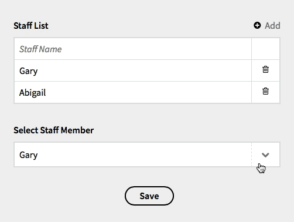

# Select-A-Structure

This is a select field for [Kirby](https://getkirby.com) that pulls it's options from a specified structure field found on _any_ page of the website. Credit to [Sonja](https://forum.getkirby.com/t/fetch-query-from-parent-page/1290/6) for the intial version, I just made it a little more awesome and packaged it as a plugin.

## Installation

Clone or [download](https://github.com/CalebGrove/select-a-structure/archive/master.zip) this repo, and rename the folder to `select-a-structure`. Move it into your `site/plugins` folder (if that folder doesn't exist, create it).

If you are using the [Kirby CLI](https://github.com/getkirby/cli), you can install it using this command:

~~~~
kirby plugin:install CalebGrove/select-a-structure
~~~~

## Setup

First, create your structure field anywhere on the website and populate it.

Then, put this into your blueprint where you want the select field to appear:

~~~~ yaml
fieldname:
  label: Field Label
  type: selectastructure
  structurepage: staffpage
  structurefield: stafflist
  optionkey: staffname
~~~~

You'll want to change these required options:

<dl>
<dt><code>structurepage:</code></td>
<dd>The URI of the page that hosts the structure field. You can use subpages too, like this: <code>page/subpage</code>. The current page can by selected by leaving this blank. To point to the <code>site()</code> page, use <code>/</code></dd>

<dt><code>structurefield:</code></dt>
<dd>The name of the structure field found on <code>structurepage</code>.</dd>

<dt><code>optionkey:</code></dt>
<dd>The name of the field <strong>inside</strong> the structure used for the options in the select field.</dd>
</dl>

## Usage

Use in your templates just like any select field. The data stored by the field exactly matches the text shown in the options.

_And you're ready to rock and roll!_
